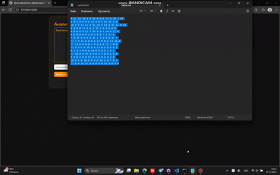

# math_digital_D-W

# Универ: Алгоритмы Дейкстры и Уоршелла
________________
# Титульная часть

## Разработчик программы:
- Степанов Роман Сергеевич

### Группа:
- ДЗ-21 (2401)


### Преподаватель:
- Докучаев Сергей Аркадьевич

_______
# Алгоритмы:

## 🧭 Дейкстра — кратчайшие пути в взвешенном орграфе (веса > 0):
- по очереди фиксируем вершину с минимальной дистанцией, релаксируем рёбра.

## 🧮 Уоршелл — транзитивное замыкание:
- для каждой промежуточной вершины k обновляем достижимость пар (i, j).

_______

# Примечание:

## Язык программирования:
- Python

## WEB-страничка программы:
#### при локальном запуске (на своём ПК):
- http://127.0.0.1:5000/
________

# README по запуску:
> [!WARNING]  
> 1) Данная программа тестировалась на ПК с операционной системой Windows 11
> 2) Перед выполнением дальнейших инструкции убедитесь в наличии актуальной версии Python (я использовал версию 3.12.0 https://www.python.org/downloads/release/python-3120/ ), а также проверьте утилиту pip.
> 3) Для ВТОРОГО пункта пишем в командной строке (CMD) для проверки версии:

```
python --version
pip --version
```

_____________
## Приступаем:

1. На этой же страничке с github-репозиторием (где вы сейчас находитесь и читаете инструкцию) скачиваем архив с данным проектом (ПУТЬ: code --> DOWNLOAD ZIP).

2. Распакуйте скачанный архив (желательно, чтобы путь с архивированным проектом не имел кириллицы !!!)

3. Открываем ОДНО окно командной строки (CMD) с правами администратора (!!!)

4. Переходим по пути с проектом. Мой пример:

```
cd C:\...\maths_digital_dj-warsh\code
```

5. Создаём и активируем виртуальное окружение:

```
python -m venv venv
.\venv\Scripts\activate
```

- Итог:

```
(venv) C:\...\maths_digital_dj-warsh\code
```

6. Устанавливаем зависимости по Python-языку:

```
pip install -r requirements.txt
```

7. Запускаем программу:

```
python app.py
```

8. Переходим по ссылке:

- http://127.0.0.1:5000/

_______

# Демонстрация работы программы

#### Мой вариант ---> 16 (все алгоритмы !!!)

## Алгоритм Дейкстры:


## Алгоритм Уоршелла:

